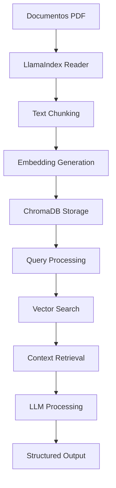

# RAG (Retrieval-Augmented Generation) 🧠

Um guia completo para implementar sistemas RAG robustos com persistência, usando LlamaIndex e ChromaDB para extração de dados estruturados de documentos.

- **[🚀 Exemplo Prático RAG](./apps/ia/examples/rag-chroma/)** - Implementação funcional com LlamaIndex e ChromaDB

## 🎯 O que é RAG?

**RAG (Retrieval-Augmented Generation)** é uma arquitetura que combina:
- **Retrieval**: Busca de informações relevantes em uma base de conhecimento
- **Augmented**: Enriquecimento do contexto com dados recuperados
- **Generation**: Geração de respostas usando modelos de linguagem

Esta abordagem permite que LLMs acessem informações específicas e atualizadas sem precisar ser retreinados.

## 🏗️ Arquitetura RAG com Persistência

### Componentes Principais

1. **📄 Documentos**: PDFs, textos, dados estruturados
2. **🔍 Vector Store**: ChromaDB para armazenamento persistente de embeddings
3. **🧠 LLM**: Modelo de linguagem para processamento e geração
4. **⚙️ Orquestrador**: LlamaIndex para coordenação do processo

### Fluxo de Funcionamento



## 🚀 Implementação Prática

### Passo 0: Instalação das Dependências

```bash
pip install llama-index llama-index-vector-stores-chroma llama-index-llms-openai chromadb reportlab pydantic
```

**Configuração da API Key:**
```bash
export OPENAI_API_KEY="sua_chave_aqui"
```

### Passo 1: Código Completo

```python
import os
from reportlab.pdfgen import canvas
from reportlab.lib.pagesizes import letter
from typing import List, Optional

# --- LlamaIndex & ChromaDB Imports ---
from llama_index.core import VectorStoreIndex, SimpleDirectoryReader, StorageContext
from llama_index.vector_stores.chroma import ChromaVectorStore
from llama_index.llms.openai import OpenAI
import chromadb

# --- Pydantic para Saída Estruturada ---
from pydantic import BaseModel, Field

# ==============================================================================
# 1. FUNÇÕES AUXILIARES PARA CRIAR PDFs DE EXEMPLO
# ==============================================================================
def setup_documentos(diretorio="documentos_pdf"):
    """Cria um diretório e alguns PDFs de exemplo dentro dele."""
    os.makedirs(diretorio, exist_ok=True)
    
    # PDF 1: Fatura
    caminho_fatura = os.path.join(diretorio, "fatura_001.pdf")
    if not os.path.exists(caminho_fatura):
        print(f"Criando PDF: {caminho_fatura}")
        c = canvas.Canvas(caminho_fatura, pagesize=letter)
        c.drawString(72, 800, "Fatura Nº: 2025-001")
        c.drawString(72, 780, "Cliente: Corporação Acme")
        c.drawString(72, 760, "Item: Serviço de Consultoria de Agentes IA")
        c.drawString(72, 740, "Valor Total: R$ 7500.00")
        c.save()

    # PDF 2: Proposta de Projeto
    caminho_proposta = os.path.join(diretorio, "proposta_phoenix.pdf")
    if not os.path.exists(caminho_proposta):
        print(f"Criando PDF: {caminho_proposta}")
        c = canvas.Canvas(caminho_proposta, pagesize=letter)
        c.drawString(72, 800, "Proposta de Projeto: Phoenix")
        c.drawString(72, 780, "Cliente: Stark Industries")
        c.drawString(72, 760, "Descrição: Desenvolvimento de um novo sistema de energia.")
        c.drawString(72, 740, "Valor Total: R$ 1,200,000.00")
        c.save()

# ==============================================================================
# 2. DEFINIR O SCHEMA DE SAÍDA ESTRUTURADA (JSON)
# ==============================================================================
class EntidadeExtraida(BaseModel):
    """Modelo para os dados que queremos extrair dos documentos."""
    nome_cliente: Optional[str] = Field(description="O nome do cliente associado ao documento.")
    nome_projeto: Optional[str] = Field(description="O nome do projeto, se mencionado.")
    valor_total: Optional[float] = Field(description="O valor financeiro total encontrado no documento.")

# ==============================================================================
# 3. LÓGICA PRINCIPAL: INDEXAR, PERSISTIR E CONSULTAR
# ==============================================================================
def main():
    # --- Configurações ---
    PDF_DIRECTORY = "./documentos_pdf"
    DB_PATH = "./chroma_db"
    COLLECTION_NAME = "documentos_collection"

    # Passo 1: Criar os documentos de exemplo
    setup_documentos(PDF_DIRECTORY)

    # Passo 2: Inicializar o cliente ChromaDB persistente
    # Ele criará o diretório DB_PATH se não existir
    db = chromadb.PersistentClient(path=DB_PATH)
    
    # Passo 3: Obter ou criar a coleção no ChromaDB
    # Esta é a chave para a persistência!
    chroma_collection = db.get_or_create_collection(COLLECTION_NAME)

    # Passo 4: Criar o LlamaIndex VectorStore em cima da coleção do Chroma
    vector_store = ChromaVectorStore(chroma_collection=chroma_collection)
    
    # --- Lógica de "Save" vs "Load" ---
    # Verificamos se a coleção já tem documentos.
    # Se count() for 0, é a primeira vez, então precisamos indexar.
    if chroma_collection.count() == 0:
        print("Coleção vazia. Indexando novos documentos...")
        
        # Carregar documentos do diretório
        documents = SimpleDirectoryReader(PDF_DIRECTORY).load_data()
        
        # Criar o StorageContext e o Index
        storage_context = StorageContext.from_defaults(vector_store=vector_store)
        index = VectorStoreIndex.from_documents(
            documents, storage_context=storage_context
        )
        print(f"Indexação concluída. {len(documents)} documentos adicionados à coleção '{COLLECTION_NAME}'.")
    else:
        print(f"Carregando índice a partir do ChromaDB existente na coleção '{COLLECTION_NAME}'...")
        # Se a coleção já tem dados, LlamaIndex pode usá-la diretamente
        index = VectorStoreIndex.from_vector_store(
            vector_store=vector_store,
        )
        print("Índice carregado com sucesso.")

    # Passo 5: Criar o Query Engine para extrair dados estruturados
    query_engine = index.as_query_engine(
        output_cls=EntidadeExtraida,
        llm=OpenAI(model="gpt-4-turbo"), # Modelos fortes são melhores para extração
    )

    # Passo 6: Fazer a consulta
    # A query é projetada para forçar o RAG a olhar os dois documentos
    query_str = "Qual o valor total da proposta para a Stark Industries e quem é o cliente da fatura 2025-001?"
    
    print("\n--- Executando Consulta ---")
    print(f"Query: {query_str}")
    
    response = query_engine.query(query_str)
    
    # O resultado já é um objeto Pydantic
    dados_extraidos = response.response
    
    print("\n--- Dados Estruturados Extraídos (JSON) ---")
    print(dados_extraidos.model_dump_json(indent=2))


if __name__ == "__main__":
    main()
```

## 🔄 Persistência e Otimização

### Primeira Execução
```bash
python rag_com_chroma.py
```

**Saída esperada:**
```
Criando PDF: documentos_pdf/fatura_001.pdf
Criando PDF: documentos_pdf/proposta_phoenix.pdf
Coleção vazia. Indexando novos documentos...
[...logs de processamento...]
Indexação concluída. 2 documentos adicionados à coleção 'documentos_collection'.

--- Executando Consulta ---
Query: Qual o valor total da proposta para a Stark Industries e quem é o cliente da fatura 2025-001?

--- Dados Estruturados Extraídos (JSON) ---
{
  "nome_cliente": "Corporação Acme",
  "nome_projeto": "Phoenix",
  "valor_total": 1200000.0
}
```

### Segunda Execução (Persistência)
```bash
python rag_com_chroma.py
```

**Saída esperada:**
```
Carregando índice a partir do ChromaDB existente na coleção 'documentos_collection'...
Índice carregado com sucesso.

--- Executando Consulta ---
Query: Qual o valor total da proposta para a Stark Industries e quem é o cliente da fatura 2025-001?

--- Dados Estruturados Extraídos (JSON) ---
{
  "nome_cliente": "Corporação Acme",
  "nome_projeto": "Phoenix",
  "valor_total": 1200000.0
}
```

**⚡ Performance**: A segunda execução é significativamente mais rápida, pois os embeddings já estão armazenados no ChromaDB.

## 🎯 Casos de Uso

### 1. Extração de Dados Financeiros
- **Input**: Faturas, propostas, contratos
- **Output**: Valores, clientes, datas em formato JSON estruturado
- **Aplicação**: Automação de processos contábeis

### 2. Análise de Documentos Legais
- **Input**: Contratos, termos de serviço, políticas
- **Output**: Cláusulas específicas, obrigações, prazos
- **Aplicação**: Compliance e análise de risco

### 3. Processamento de Relatórios
- **Input**: Relatórios técnicos, análises de mercado
- **Output**: Métricas, tendências, insights
- **Aplicação**: Business intelligence automatizado

### 4. Gestão de Conhecimento
- **Input**: Manuais, documentação técnica, FAQs
- **Output**: Respostas contextuais e precisas
- **Aplicação**: Sistemas de suporte e helpdesk

## 🛠️ Configurações Avançadas

### Modelos de Embedding
```python
# Usar diferentes modelos de embedding
from llama_index.embeddings.openai import OpenAIEmbedding

embed_model = OpenAIEmbedding(
    model="text-embedding-3-large",
    dimensions=3072  # Dimensões customizadas
)
```

### Chunking Estratégico
```python
from llama_index.core.node_parser import SentenceSplitter

# Configurar tamanho e sobreposição dos chunks
node_parser = SentenceSplitter(
    chunk_size=1024,
    chunk_overlap=200
)
```

### Filtros e Metadados
```python
# Adicionar metadados aos documentos
documents = SimpleDirectoryReader(PDF_DIRECTORY).load_data()
for doc in documents:
    doc.metadata = {
        "source": doc.metadata.get("file_path", ""),
        "type": "financial_document",
        "processed_at": datetime.now().isoformat()
    }
```

## 📊 Métricas e Monitoramento

### Performance
- **Tempo de Indexação**: Medir velocidade de processamento inicial
- **Tempo de Query**: Monitorar latência das consultas
- **Precisão**: Avaliar qualidade das extrações

### Qualidade
- **Relevância**: Verificar se os chunks recuperados são relevantes
- **Completude**: Garantir que todas as informações necessárias são extraídas
- **Consistência**: Manter qualidade uniforme entre diferentes documentos

## 🔧 Troubleshooting

### Problemas Comuns

1. **Erro de API Key**
   ```bash
   # Verificar se a variável está configurada
   echo $OPENAI_API_KEY
   ```

2. **Memória Insuficiente**
   ```python
   # Reduzir tamanho dos chunks
   node_parser = SentenceSplitter(chunk_size=512)
   ```

3. **Qualidade Baixa das Extrações**
   ```python
   # Usar modelo mais poderoso
   llm=OpenAI(model="gpt-4-turbo")
   ```

### Otimizações

1. **Cache de Embeddings**: Reutilizar embeddings para documentos similares
2. **Indexação Incremental**: Adicionar apenas novos documentos
3. **Compressão**: Usar modelos de embedding com menos dimensões
4. **Filtros**: Implementar filtros por metadados para consultas mais precisas

## 🚀 Próximos Passos

- [ ] Integração com banco de dados para metadados
- [ ] Interface web para upload de documentos
- [ ] Sistema de versionamento de documentos
- [ ] Análise de sentimento e classificação automática
- [ ] Integração com APIs externas para enriquecimento
- [ ] Sistema de feedback para melhoria contínua

## 📚 Referências

- [LlamaIndex Documentation](https://docs.llamaindex.ai/)
- [ChromaDB Documentation](https://docs.trychroma.com/)
- [OpenAI API Reference](https://platform.openai.com/docs)
- [Pydantic Documentation](https://docs.pydantic.dev/)

## 🤝 Contribuindo

Para contribuir com melhorias no sistema RAG:

1. **Testes**: Adicione casos de teste para novos tipos de documentos
2. **Performance**: Otimize algoritmos de chunking e embedding
3. **Documentação**: Melhore exemplos e casos de uso
4. **Integração**: Adicione suporte para novos formatos de arquivo
5. **Monitoramento**: Implemente métricas de qualidade e performance

---

**💡 Dica**: Este sistema RAG pode ser facilmente integrado com agentes LangGraph para criar workflows mais complexos e inteligentes, seguindo os princípios estratégicos definidos na documentação do projeto.
