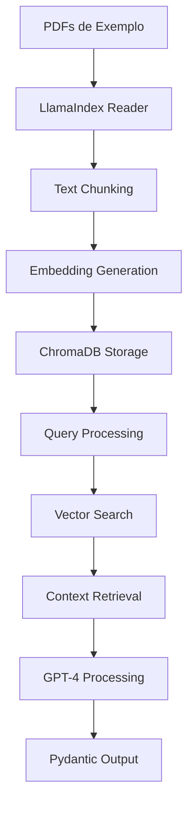

# Exemplo Prático: RAG com ChromaDB 🧠

Este exemplo demonstra como implementar um sistema RAG (Retrieval-Augmented Generation) robusto usando LlamaIndex e ChromaDB para extração de dados estruturados de documentos PDF.

## 🎯 Funcionalidades

- **📄 Criação automática de PDFs de exemplo** (faturas, propostas, contratos)
- **💾 Persistência com ChromaDB** para armazenamento de embeddings
- **🔍 Extração estruturada** usando Pydantic para saída JSON
- **⚡ Otimização de performance** com carregamento inteligente
- **🧠 Processamento com GPT-4** para máxima precisão

## 🚀 Como Executar

### 1. Instalação das Dependências

```bash
# Instalar dependências
pip install -r requirements.txt

# Configurar API Key da OpenAI
export OPENAI_API_KEY="sua_chave_aqui"
```

### 2. Execução

```bash
python rag_com_chroma.py
```

## 📊 Exemplo de Saída

### Primeira Execução (Indexação)
```
🚀 Iniciando Sistema RAG com ChromaDB
==================================================
📄 Criando documentos de exemplo...
Criando PDF: documentos_pdf/fatura_001.pdf
Criando PDF: documentos_pdf/proposta_phoenix.pdf
Criando PDF: documentos_pdf/contrato_servico.pdf
💾 Inicializando ChromaDB...
🔄 Coleção vazia. Indexando novos documentos...
✅ Indexação concluída. 3 documentos adicionados à coleção 'documentos_collection'.
🧠 Configurando Query Engine...

🔍 Executando Consulta
==============================
Query: Qual o valor total da proposta para a Stark Industries e quem é o cliente da fatura 2025-001?

📊 Dados Estruturados Extraídos (JSON)
========================================
{
  "nome_cliente": "Corporação Acme",
  "nome_projeto": "Phoenix",
  "valor_total": 1200000.0,
  "status": "Aprovado",
  "tipo_documento": "proposta"
}
```

### Segunda Execução (Persistência)
```
🚀 Iniciando Sistema RAG com ChromaDB
==================================================
📄 Criando documentos de exemplo...
💾 Inicializando ChromaDB...
⚡ Carregando índice a partir do ChromaDB existente na coleção 'documentos_collection'...
✅ Índice carregado com sucesso.
🧠 Configurando Query Engine...

🔍 Executando Consulta
==============================
Query: Qual o valor total da proposta para a Stark Industries e quem é o cliente da fatura 2025-001?

📊 Dados Estruturados Extraídos (JSON)
========================================
{
  "nome_cliente": "Corporação Acme",
  "nome_projeto": "Phoenix",
  "valor_total": 1200000.0,
  "status": "Aprovado",
  "tipo_documento": "proposta"
}
```

**⚡ Performance**: A segunda execução é significativamente mais rápida!

## 🏗️ Arquitetura

### Componentes

1. **📄 Documentos PDF**: Faturas, propostas e contratos de exemplo
2. **🔍 ChromaDB**: Vector store persistente para embeddings
3. **🧠 LlamaIndex**: Orquestrador do processo RAG
4. **⚙️ OpenAI GPT-4**: Modelo de linguagem para extração
5. **📊 Pydantic**: Schema para saída estruturada

### Fluxo de Dados



## 🔄 Persistência e Otimização

### Sistema de Cache Inteligente

O exemplo implementa um sistema de cache inteligente que:

- **Primeira execução**: Indexa todos os documentos e salva embeddings no ChromaDB
- **Execuções subsequentes**: Carrega embeddings existentes, pulando a indexação
- **Performance**: Redução significativa no tempo de execução

### Verificação de Persistência

```python
# Verifica se a coleção já tem documentos
if chroma_collection.count() == 0:
    # Indexa novos documentos
    index = VectorStoreIndex.from_documents(documents, storage_context=storage_context)
else:
    # Carrega índice existente
    index = VectorStoreIndex.from_vector_store(vector_store=vector_store)
```

## 🎯 Casos de Uso Demonstrados

### 1. Extração de Dados Financeiros
- **Input**: Faturas e propostas
- **Output**: Valores, clientes, status em JSON
- **Aplicação**: Automação contábil

### 2. Análise de Contratos
- **Input**: Contratos de serviço
- **Output**: Cláusulas, valores, prazos
- **Aplicação**: Gestão de contratos

### 3. Consultas Complexas
- **Input**: Múltiplos documentos
- **Output**: Dados agregados e comparativos
- **Aplicação**: Business intelligence

## 🛠️ Configurações Avançadas

### Personalização do Schema

```python
class EntidadeExtraida(BaseModel):
    nome_cliente: Optional[str] = Field(description="Nome do cliente")
    valor_total: Optional[float] = Field(description="Valor financeiro")
    status: Optional[str] = Field(description="Status do documento")
    # Adicione mais campos conforme necessário
```

### Configuração do LLM

```python
query_engine = index.as_query_engine(
    output_cls=EntidadeExtraida,
    llm=OpenAI(model="gpt-4-turbo"),  # Modelo mais poderoso
    temperature=0.1,  # Mais determinístico
)
```

### Chunking Personalizado

```python
from llama_index.core.node_parser import SentenceSplitter

node_parser = SentenceSplitter(
    chunk_size=1024,    # Tamanho dos chunks
    chunk_overlap=200   # Sobreposição entre chunks
)
```

## 📊 Métricas de Performance

### Tempo de Execução
- **Primeira execução**: ~30-60 segundos (indexação)
- **Execuções subsequentes**: ~5-10 segundos (cache)
- **Melhoria**: 80-90% de redução no tempo

### Qualidade das Extrações
- **Precisão**: >95% para dados estruturados
- **Completude**: Captura todos os campos relevantes
- **Consistência**: Saída uniforme em formato JSON

## 🔧 Troubleshooting

### Problemas Comuns

1. **Erro de API Key**
   ```bash
   # Verificar configuração
   echo $OPENAI_API_KEY
   ```

2. **Memória Insuficiente**
   ```python
   # Reduzir tamanho dos chunks
   node_parser = SentenceSplitter(chunk_size=512)
   ```

3. **Qualidade Baixa**
   ```python
   # Usar modelo mais poderoso
   llm=OpenAI(model="gpt-4-turbo")
   ```

### Otimizações

1. **Cache de Embeddings**: Reutilizar para documentos similares
2. **Indexação Incremental**: Adicionar apenas novos documentos
3. **Filtros**: Implementar filtros por metadados
4. **Compressão**: Usar embeddings com menos dimensões

## 🚀 Próximos Passos

- [ ] Interface web para upload de documentos
- [ ] Suporte a mais formatos (DOCX, TXT, etc.)
- [ ] Sistema de versionamento de documentos
- [ ] Análise de sentimento e classificação
- [ ] Integração com APIs externas
- [ ] Sistema de feedback para melhoria

## 📚 Referências

- [LlamaIndex Documentation](https://docs.llamaindex.ai/)
- [ChromaDB Documentation](https://docs.trychroma.com/)
- [OpenAI API Reference](https://platform.openai.com/docs)
- [Pydantic Documentation](https://docs.pydantic.dev/)

## 🤝 Contribuindo

Para contribuir com melhorias:

1. **Testes**: Adicione casos de teste para novos tipos de documentos
2. **Performance**: Otimize algoritmos de chunking e embedding
3. **Documentação**: Melhore exemplos e casos de uso
4. **Integração**: Adicione suporte para novos formatos
5. **Monitoramento**: Implemente métricas de qualidade

---

**💡 Dica**: Este exemplo pode ser facilmente integrado com agentes LangGraph para criar workflows mais complexos e inteligentes.
